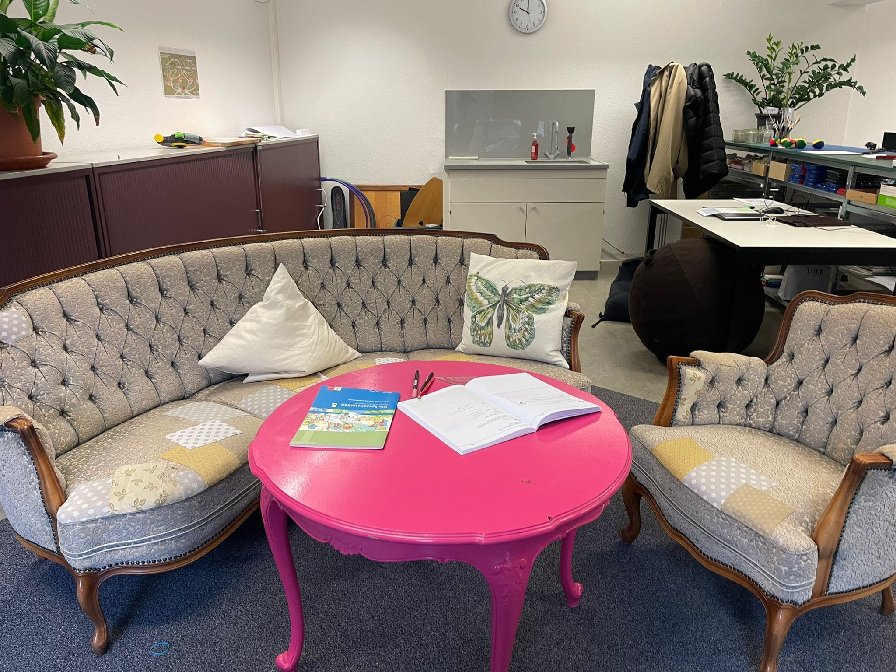
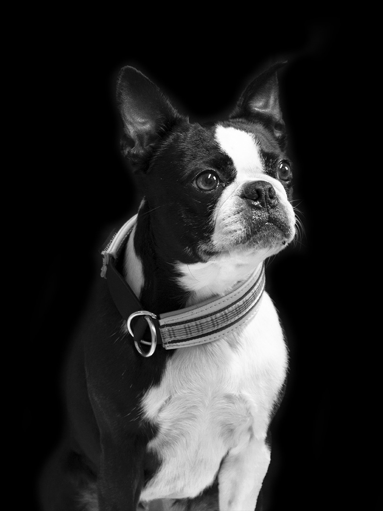

+++
title = "Das ganze Spektrum des Sportes"
date = "2023-05-04"
draft = false
pinned = false
image = "bild-autismuslink.jpg"
+++


Die Schule Autismuslink unterrichtet Schüler:innen auf dem Autismus-Spektrum. Roman Roner, der Schulleiter, gewährt uns einen Einblick in den interessanten und herausfordernden Schulalltag der Schüler:innen und Lehrpersonen dieser speziellen Schule. Eine besondere Bedeutung kommt dabei dem Fach Sport zu. Bewegung scheint sich besonders positiv auf die Betroffenen auszuwirken.



Wir stehen vor der Türe und ein kleiner Hund kommt uns freudvoll bellend und im Kreis herumspringend, begrüßen. Das Gefühl von Willkommen-sein wird von Allen für Alle ausgestrahlt und hat uns sofort gepackt, als wir die Räume von Autismuslink betreten. Das Klassenzimmer ist abgedunkelt, damit der Reiz des Lichtes wegfällt aber mit einer offenen und farbigen Raumgestaltung kommt eine gemütliche Stimmung auf.

Eine reportage von Danielle Gnägi und Juliette Bartlome



Autismus ist eine neurologische Entwicklungsstörung, die sich auf die sozialen Interaktionen, die Kommunikation und das Verhalten auswirken kann. Die Symptome werden auf einem Spektrum von schwach bis stark definiert.



**Reizüberflutung**  

Die Frustration, in einem vollen Zug zu sitzen. Wir alle haben das Gefühl sicherlich schon erlebt. Multipliziert man die eigenen Emotionen mit 1000 und man kann sich vorstellen, wie sich jemand aus dem Spektrum fühlen könnte. Als Neurotypen sind wir normalerweise in der Lage zu verstehen, warum wir uns gerade so fühlen und entweder einen Weg finden, damit umzugehen oder es schließlich zu vergessen. Für Menschen im Spektrum können jedoch “kleine“ Veränderungen in ihrem Tagesablauf wie z. B. eine andere Zahnpasta Marke oder ein helleres Licht als gewöhnlich, einen negativen Einfluss auf den Rest ihres Tages haben. Reize können schnell überwältigend sein und es kann für Menschen auf dem Spektrum schwieriger sein, ihre Emotionen so zu kontrollieren, als für Menschen, die nicht auf dem Spektrum sind, es tun. 

Autismuslink basiert auf dem Prinzip, sich an die Schüler anzupassen, indem sie Veränderungen in kleinen Schritten tun, wie zum Beispiel das Licht während des Unterrichts dimmen. Die Lehrpersonen können jedoch nicht alle Stimulanzien vollständig vermeiden, das ist einfach nicht möglich. Insbesondere beim Sport ist das häufig der Fall. 

**Unterrichtsgestaltung Sport**

Nach einer anstrengenden Sport-Einheit verspüren wir das Verlangen nach einer kalten Dusche, um den Schweiß abzuduschen und uns frisch zu fühlen. Doch Duschen ist ein anstrengender und schwieriger Prozess für viele Menschen, die im Autismus Spektrum sind. Die Unterrichtsgestaltung vom Fach Sport ist deshalb auch so ausgelegt, dass nach dem Unterricht nicht geduscht werden muss. Der Sport im Allgemeinen, kann überfordernd sein für Menschen im Autismus-Spektrum. Die herumfliegenden Bälle und die lauten Stimmen können schnell zu einer Reizüberflutung führen. Die Schule Autismuslink hat den Sportunterricht deshalb nach diesen Kriterien gestaltet. Bei schönem Wetter gehen die Lehrpersonen und Schüler\*innen raus spazieren und sonst werden in der Schule mit Yogamatten Kraftübungen ausgeführt, damit eine aktive Bewegung für die Schüler\*innen gewährleistet ist, die den Kriterien entspricht. Die Schule ist immer noch daran, den Sportunterricht zu perfektionieren, um die Schüler*innen zu motivieren, dass sie sich bewegen.



Roman Roner ist der Schulleiter der Schule Autismuslink und arbeitet seit 5 Jahren mit den Jugendlichen. Die Freude an seiner Arbeit liegt vor allem darin, dass er Individuell auf die Menschen eingehen kann. Ihm spielt es keine Rolle ob die Menschen eine Diagnose haben oder nicht, da er findet, dass alle Menschen ihre eigenen Eigenschaften und Fähigkeiten haben.

 

«**Hey säg dini meinig versuch dini meinig z formuliere**»

Herausforderungen sind individuell. „Obwohl ich schon seit 5 Jahren mit den Jugendlichen arbeite, muss ich mich auch immer wieder daran erinnern: Was ist Glück, wie definiert man Glück?»

Offene Fragen gehen die meisten Menschen, die sogenannten Neurotypen, normalerweise mit einer logischen und philosophischen Denkweise an. Sie schätzen es, angeregte Gespräche und Diskussionen zu führen, und durch den Austausch von verschiedenen Meinungen auch gelegentlich die eigene Meinung zu überdenken. Ob es sich um Glaubensunterschiede oder Weltanschauungen handelt, Diskussionen ermöglichen es uns, unser Wissen zu erweitern. Normalerweise reflektieren wir danach auch darüber, um zu versuchen, Menschen zu verstehen und warum sie so denken, wie sie denken. 

Dies ist jedoch sehr oft nicht der Fall für Menschen, die sich auf dem Autismus-Spektrum befinden. Für sie können offene Fragen oder Gespräche über sich selbst und ihre Emotionen schnell überwältigend werden. Das kann zu Verzweiflung und Hyperventilationen führen. Um ihnen zu helfen, versuchen die Lehrpersonen von Autismuslink, die Art und Weise, wie die betroffenen Jugendlichen ihren Schultag führen, den Schüler:innen anzupassen, um eine angenehmere Umgebung zu schaffen. Gleichzeitig gilt es aber auch zu berücksichtigen, dass die Schüler:innen nicht in einer «Bubble» leben und womöglich ihr Spektrum noch breiter wird. Um sich den Schüler:innen anzupassen und ihnen gleichzeitig zu helfen, aus ihrer «Bubble» herauszutreten, ermutigen die Lehrpersonen die Jugendlichen, ihre Meinung zu sagen oder zu versuchen, ihre Gedanken zu formulieren. Dies hilft den Lehrpersonen, einen kleinen Einblick in das zu bekommen, was im Kopf des Einzelnen vor sich geht, um den besten Weg finden können, ihnen zu helfen. Ziel ist es, dass die Schüler*innen ihre Emotionen und Frustrationen in Worte fassen können.



Nayla ist eine wichtige Begleitung bei Autismuslink. Sie ist der Schulhund und verbreitet eine gute Stimmung. Ihre Aufgabe bei Autismuslink ist die Pausenaufsicht, welche sie gut und freudig erledigt.

